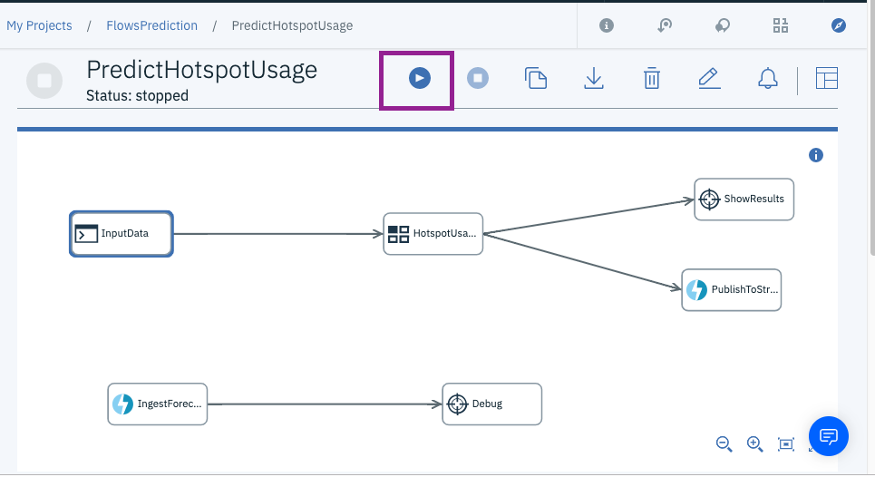

## Score streaming data with R and Streams flows

This is the sample code for the video [Score streaming data in R with Watson Studio Streams Flows](https://youtu.be/gZAoDOus0vc).
Sample includes
- Precompiled versions of the microservice are in the `bin` folder, so you can try the application without having to compile any code.
- [Sample flow](PredictHotspotUsage.stp) (uses generated data).

* Running the sample
  * [Import and run the sample flow](#import-the-sample-flow-into-watson-studio)
  * [Launch the microservice](#launch-the-forecasting-microservice)
* [Modify the sample](#launch-the-forecasting-microservice)

To run the sample, you need to
- Import and run the sample flow in Watson Studio Streams flows.
- Run the forecasting microservice in the Streaming analytics service.

### Import the sample flow into Watson Studio
First, create an account in Watson Studio and an instance of the Streaming analytics service.

- [Sign up for Watson Studio](https://dataplatform.cloud.ibm.com)  if you haven't already.
- Upload the sample flow:
  - Download the [PredictHotspotUsage.stp](LINK) file
  - From Watson Studio, [create a project](https://dataplatform.cloud.ibm.com/docs/content/wsj/getting-started/projects.html) if you do not have one.
  - Follow [these steps to upload the sample flow you just downloaded](https://dataplatform.cloud.ibm.com/docs/content/wsj/streaming-pipelines/creating-pipeline-import.html?audience=wdp&linkInPage=true).
  - Start the flow:
  

### Launch the forecasting microservice
Once the flow is running, submit the forecasting microservice. There are 2 versions of the application:
 - `bin/score.Forecast_With_R.sab`, just scores the data and publishes the results
 - `bin/score.Forecast_With_ModelUpdates.sab`  is configured to connect to Cloud Object Storage (COS) for updates to the model.

To use the application that has model updates enabled, follow the steps below to configure Cloud object storage.]LINK]

#### Launching the microservice
- From the metrics page of the flow, open the Streaming analytics dashboard by clicking  **Show notifications** > **Manage [your instance name]  in the cloud**.
  
- Once it opens, click the submit button
   
- Upload the `bin/score.Forecast_With_R.sab` file.
- Once the application is running, the streams graph should look like this:
  

You can return to the flow and see that the forecast results are being ingested correctly.
  

#### Configure Streaming analytics service to connect to Cloud object storage
If you want to run the version of the application that has model updates, you must:
1. Create an instance of Cloud Object Storage in the IBM cloud.
2. Configure your [Streaming analytics service to connect to Cloud Object Storage instance as described here](https://ibmstreams.github.io/streamsx.objectstorage/doc/spldoc/html/tk$com.ibm.streamsx.objectstorage/tk$com.ibm.streamsx.objectstorage$9.html).
3. Create a bucket called `models-demo` in your COS instance.

## Modifying the sample
If you want to modify the microservice, you can [install the Streams plugins for VS Code or Atom](https://developer.ibm.com/streamsdev/docs/develop-run-streams-applications-using-atom-visual-studio-code/) and then import the source code into the editor.

